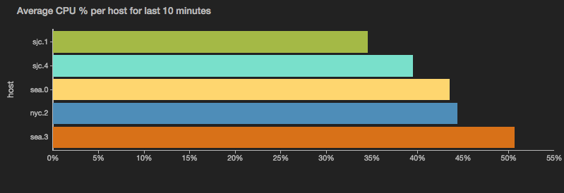
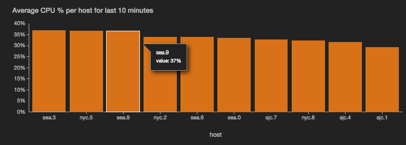

barchart
========

Display the output as vertical or horizontal bars for comparing different categories of data.



:information_source: | Note: When working with batched data, only values from the last batch are displayed. See `-resetCategories` below for more details on how categories are treated across batches.

```
view barchart -o {
   categoryField: 'fieldname',
   id: 'string',
   title: 'string',
   color: 'color',
   negativeColor: 'color',
   colorful: true|false,
   orientation: 'vertical'|'horizontal',
   resetCategories: n,
   xScale: {
     label: 'auto'|'fieldname'
   },
   yScales: {
     primary: {
       label: 'fieldname',
       tickFormat: 'd3FormatString',
       minValue: 'fieldname',
       maxValue: 'fieldname'
       displayOnAxis: 'axisname'
     }
   },
   valueField: 'fieldname',
   tooltip: {
     nameField: 'fieldname',
     valueField: 'fieldname',
     valueFormat: 'd3FormatString'
   }
}
```

*or*
```
view barchart -id 'string' -title: 'string'
  -color 'color' -negativeColor 'color'
   -orientation 'vertical'|'horizontal' -resetCategories n
   -colorful true|false -xScale.label 'fieldname'
   -yScales.primary.label 'auto'|'fieldname' -yScales.primary.tickFormat 'd3FormatString' -yScales.primary.minValue 'fieldname' -yScales.primary.maxValue 'fieldname' -yScales.primary.displayOnAxis 'axisname'
   -categoryField 'fieldname' -valueField 'fieldname'
   -tooltip.nameField 'fieldname' -tooltip.valueField 'fieldname' -tooltip.valueFormat 'd3FormatString'
```

See [Defining sink parameters](../index.md#defining-view-parameters) for an explanation of how sink parameters can be expressed as object literals.

Parameter  |  Description  |  Required?
---------- | ------------- | ---------:
`-id`  |  An identifier for this sink that serves as a handle for referencing the object in Juttle syntax; conceptually identical to a variable name  |  No
`-title`  |  The title for the user-visible output, if it has one; the value may be any valid Juttle expression that produces a string  |  No; defaults to the name field that is present in all metrics points
`-categoryField`  |  The name of the field to use as the category accessor. Categories are displayed in the order in which they appear in the data stream, from left to right or, in the case of horizontal bars, from top to bottom.   |  No; if there is only one field in the incoming data besides time, source\_type,value, and name, then that field becomes the category accessor
`-valueField`  | The name of the field to use as the source for the numeric values  |  No; defaults to the `value` field that is present in all metrics points. If no value field is present, the first numeric field in the stream is used.
`-color`  |  The color to use for positive bars, specified with any [CSS3-supported hex or name value](http://www.w3.org/TR/css3-color/)  |  No; if not specified, a color is selected from the built-in palette
`-negativeColor`  |  The color to use for negative bars, specified with any [CSS3-supported hex or name value](http://www.w3.org/TR/css3-color/)  |  No; if not specified, a color is selected from the built-in palette
`-colorful`  |  When this is true, each bar in the chart is displayed in a different color.  |  No
`-orientation`  |  The orientation of the bars, either vertical or horizontal  |  No; default is vertical
`-resetCategories`  |  <p>An integer indicating the number of batches before the bar chart resets its internal list of sorted categories. This is useful only with live streaming data, particularly if the set of categories in your data changes from batch to batch and you want to periodically remove stale categories. </p><p>The default behavior is to display all categories seen in all batches. When a category disappears from the data stream, its bar is replaced by a gap indicating a null value. When a new category appears, a new bar appears to the right of all existing bars. </p><p>Set this to zero to reset on every batch, so that the bar chart always displays the categories for the current batch only. Set this to a value greater than zero to refresh the category list on every n<sup>th</sup> batch.</p>   |  No; defaults to never
`-xScale.label` | The label to display under the X axis | No; default is the name of the `-categoryField`
`-yScales.primary.label` | A string to label the Y axis | No; default is the name of the `-valueField`
`-yScales.primary.tickFormat`  |  Customize the unit display for the Y axis, using the [d3 number formatting syntax](https://github.com/mbostock/d3/wiki/Formatting)  |  No
`-yScales.primary.minValue`  |  The value at the bottom of the Y scale  |  No; the default is automatically derived from your data
`-yScales.primary.maxValue`  |  The value at the top of the Y scale  |  No; the default is automatically derived from your data
`-yScales.primary.displayOnAxis`  |  Where to display the Y axis; must be exactly one of the following depending on whether your bar chart is oriented vertically or horizontally:<ul><li>left</li><li>right</li></ul>  |  No; the default is left
`-tooltip.nameField` | The field containing the category to display in tooltips | No; defaults to the `-categoryField`
`-tooltip.valueField` | The field containing the value to display in tooltips | No; defaults to the -valueField
`-tooltip.valueFormat` | The format for the -tooltip.valueField, using the [d3 number formatting syntax](https://github.com/mbostock/d3/wiki/Formatting) | No; defaults to the `-yScales.primary.tickFormat`

_A bar chart example with options_

```
{!docs/examples/charts/barchart_options.juttle!}
```


