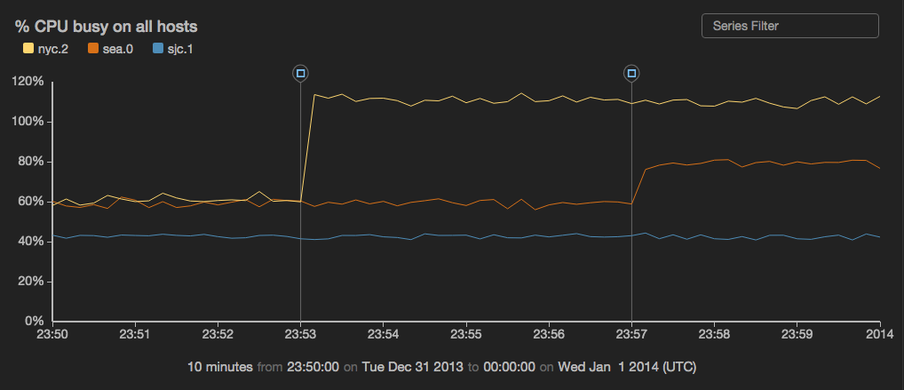

events
======

Overlay events as markers on top of a time chart.



```
view events -o {
  id: 'string',
  title: 'string',
  typeField: 'fieldname',
  nameField: 'fieldname',
  messageField: 'fieldname',
  timeField: 'fieldname',
  on: 'sinkID',
  useMarkdown: 'true|false'
}
```

*or*

```
view events -id 'string' -title 'string'
  -typeField 'fieldname'
  -nameField 'fieldname' -messageField 'fieldname' -timeField 'fieldname'
  -on 'sinkID' -useMarkdown: 'true|false'
```

See [Defining sink parameters](../index.md#defining-view-parameters)
for an explanation of how sink parameters can be expressed as object literals.

Parameter  |  Description  |  Required?
---------- | ------------- | ---------:
`-id`  |  An identifier for this sink that serves as a handle for referencing the object in Juttle syntax; conceptually identical to a variable name  |  No
`-title`  |  The title for the user-visible output, if it has one; the value may be any valid Juttle expression that produces a string  |  No; defaults to the name field that is present in all metrics points
`-typeField`  | The name of a field in your data points that contains the class string of the icon to display. If your points don't already contain such a field, you must add one like this: <br>`... | put type='fa-smile-o' ...` <br><br>Coming soon: support for[Font Awesome](http://fortawesome.github.io/Font-Awesome/cheatsheet/) class strings (such as "fa-git" for git events). |  No; the default fieldname is "type", and if no "type" field is set then the default icon is an empty circle
`-nameField`  |  The field from which to source the title of the tooltip  |  No
`-messageField`  |  The field to source the text content of the tooltip  |  No
`-timeField`  |  The field containing the time stamp  |  No; defaults to the time field
`-on`  |  The ID of the time chart upon which to overlay events. See [Overlaying events on time charts](../charts/timechart_overlay.md) for information about overlaying charts.  | No; when this option is omitted, events are displayed as a table
`-useMarkdown` | When this option is 'true', the values of the -nameField and the -messageField are parsed as markdown, allowing you to include links in your tooltips  |  No; the default is 'false'

_Example: Overlay two series of "git merge" events on a time chart showing CPU load_

```
{!docs/examples/charts/events_on_timechart.juttle!}
```


