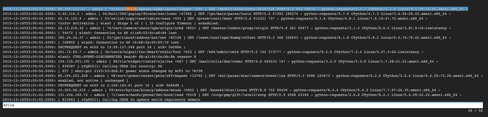

less 
====

View the time and message field values of points. You can search and navigate as you would with the UNIX less
command.


```
view less -title string
```

Parameter  |  Description  |  Required?
---------- | ------------- | ---------:
`-title`   | The title for the user-visible output, if it has one; the value may be any valid Juttle expression that produces a string  | No; defaults to the name field that is present in all metrics points

It supports these keyboard shortcuts:

Key  | Action
---- | -------
  g  | Go to the beginning of the output
  G  | Go to the end of the output
  space |  Page down
  b  | Page up
  /  | Search forward
  ?  | Search backward
  n  | Next match
  p  | Previous match
  j (or down arrow) | Move down
  k (or up arrow)   | Move up

_Example_

```
{!docs/examples/charts/view_with_less.juttle!}
```



