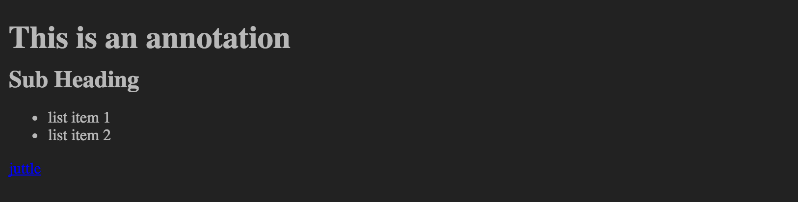

markdown
====

Render the contents of a field as markdown.



```
view markdown -title string -field string
```

Parameter  |  Description  |  Required?
---------- | ------------- | ---------:
`-title`   | The title for the user-visible output.  | No
`-field`   | The field to render.  | No; defaults to a field other than `time` found in the points.

_Example_

Output shown above

```
{!docs/examples/charts/markdown.juttle!}
```
