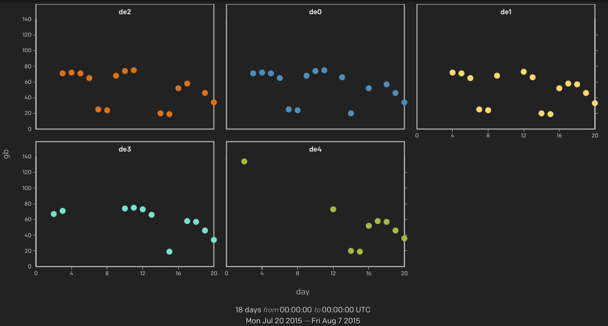
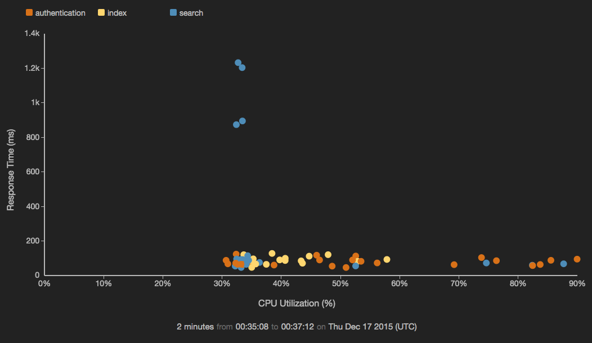
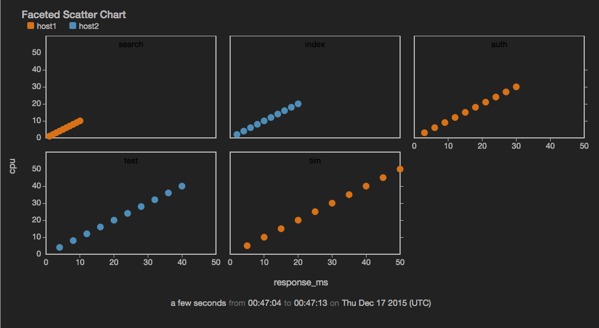

scatterchart 
============

Plot data points as individual dots across two axes sourced from the data fields; can be faceted.



``` 
view scatterchart -o {
   title: string,
   markerSize: n,
   markerOpacity: n,
   duration: duration,
   limit: n,
   valueField: fieldname,
   controlField: fieldname,
   keyField: fieldname,
   timeField: fieldname,
   xScales: {
     primary: {
       label: string,
       tickFormat: d3FormatString,
       minValue: value,
       maxValue: value
     }
   },
   yScales: {
     primary: {
       label: string,
       tickFormat: d3FormatString,
       minValue: value,
       maxValue: value,
       displayOnAxis: 'left|right'
     }
   },
   tooltip: {
     titleField: fieldname,
     controlLabel: string,
     controlFormat: d3FormatString,
     valueLabel: string,
     valueFormat: d3FormatString
   },
   series: [
   {
     name: 'string',
     label: 'string',
     color: 'color'
   },
   {
     name: 'anotherseries',
     ...
   }
   ],
   facet: {
     fields: [field1, ...fieldN],
     width: n,
     height: n
   }
```

*or*
```
view scatterchart -title string
-markerSize n -markerOpacity n -duration duration -limit n
-valueField fieldname -controlField fieldname -keyField fieldname -timeField fieldname
-xScales.primary.label string -xScales.primary.tickFormat d3FormatString -xScales.primary.minValue value -xScales.primary.maxValue value
-yScales.primary.label string -yScales.primary.tickFormat d3FormatString -yScales.primary.minValue value -yScales.primary.maxValue value -yScales.primary.displayOnAxis 'left|right'
-tooltip.titleField fieldname -tooltip.controlLabel string -tooltip.controlFormat d3FormatString -tooltip.valueLabel string -tooltip.valueFormat d3FormatString
-series [{name: 'string', label: 'string', color: 'color'},{name: 'anotherseries', ...}]
  -facet.fields field1, ...fieldN -facet.width n -face.height n
```

Parameter  |  Description  |  Required?
---------- | ------------- | ---------:
`-title`  |  The title for the user-visible output, if it has one; the value may be any valid Juttle expression that produces a string  |  No; defaults to the name field that is present in all metrics points
`-markerSize`  |  The pixel size of the circle for each point  |  No; defaults to 6
`-markerOpacity`  |  The opacity level of the datapoint marker, a number between 0.1 (10%) and 1 (100%)  |  No; defaults to 1
`-duration`   |  The span of time to display, either in seconds (&gt;=10) or as a Juttle moment literal  | No; defaults to 5 minutes when querying live data
`-limit`  |  The maximum number of total data points to display  |  No; defaults to the first 1000 to avoid consuming unbounded memory
`-valueField`  |  The name of the field to use as the source for the numeric values  |  No; defaults to the `value` field that is present in all metrics points. If no value field is present, the first numeric field in the stream is used.
`-controlField`   |  The name of the field to use as the source for the X-axis values  |  No; defaults to a field called control, if present, otherwise the second numerical field in the stream
`-keyField`  |  The field containing the name of the series to which each point belongs  |  Required when series is configured; otherwise Jut looks for unique streams and creates a series for each one. For simple metrics, the key field defaults to the `name` field that is present in all metrics points
`-timeField`  |  The field containing the time stamp  |  No; defaults to the time field
`-xScales.primary.label`  |  A string to label the X axis  | No; defaults to the name of the `-controlField`
`-xScales.primary.tickFormat`  |  Customize the unit display for this axis, using the [d3 number formatting syntax](https://github.com/mbostock/d3/wiki/Formatting)  |  No
`-xScales.primary.minValue`  |  The value at the left end of the X scale  |  No; the default is automatically derived from your data
`-xScales.primary.maxValue`  |  The value at the right end of the X scale  |  No; the default is automatically derived from your data
`-yScales.primary.label`  |  A string to label the Y axis  | No; default is the name of the `-valueField`
`-yScales.primary.tickFormat`  |  Customize the unit display for the Y axis, using the [d3 number formatting syntax](https://github.com/mbostock/d3/wiki/Formatting)  |  No
`-yScales.primary.minValue`  |  The value at the bottom of the Y scale  |  No; the default is automatically derived from your data
`-yScales.primary.maxValue`  |  The value at the top of the Y scale  |  No; the default is automatically derived from your data
`-yScales.primary.displayOnAxis`  |  Where to display the Y axis; must be exactly one of the following depending on whether your bar chart is oriented vertically or horizontally:<ul><li>left</li><li>right</li></ul>  |  No; the default is left
`-tooltip.titleField`  |  The name of the field containing a string to use as the title for the tooltip  | No; defaults to the `-keyField`
`-tooltip.controlLabel`  | A string for the label to display in the tooltip for the -controlField value  | No; defaults to the `-xScales.primary.label`
`-tooltip.controlFormat`  | The format for the `-tooltip.titleField`, using the [d3 number formatting syntax](https://github.com/mbostock/d3/wiki/Formatting)  |  No; defaults to the -xScales.primary.tickFormat
`-tooltip.valueLabel`  | A string for the label to display in the tooltip for the -valueField value  | No; defaults to the `-yScales.primary.label`
`-tooltip.valueFormat`  | The format for the -tooltip.valueField, using the [d3 number formatting syntax](https://github.com/mbostock/d3/wiki/Formatting)  | No; defaults to the `-yScales.primary.tickFormat`
`-series`  |  Configure one or more data series individually, using one or more arrays with additional parameters, [see below](#series-parameters)  |  No
`-facet.fields`  |  A comma-separated list of the fields on which facets are based  |  Required to enable faceting; omit this option to disable facets
`-facet.width`  |  The width configuration for facets, which may be a fluid or fixed width: <ul><li>Fluid width: A percentage or fraction defining the grid layout of facets, one of the following: '100%', '50%', '25%', '20%', '1/2', '1/3', '1/4', '1/5', '1/6'. For example, '1/2' means facets are displayed in two columns, as does '50%'.</li><li>Fixed width: A number larger than 150 defining the fixed pixel width of individual facets</li></ul>  |  No; defaults to '1/3'
`-facet.height`  |  A number larger than 80 defining the fixed pixel height of individual facets  |  No; the default height is calculated based on the width

**Series Parameters**

```
   -series [   
   {   
     name : 'seriesname',   
     label : 'string',   
     color : 'color'   
   },   
   {   
     name : 'someotherseries',   
     ...   
   }   
   ]   
```
Parameter |  Description
--------- | -------------    
`name`    |  A series name that can be found in the specified `-keyField`; this parameter is required for any configured series. 
`label`   |  An optional string to override the scale label for this series   
`color`   |  The color to use for this series, specified with any [CSS3-supported hex or name value](http://www.w3.org/TR/css3-color/); if not specified, a color is selected from the built-in palette   
   
_Example: Display a scatterchart showing CPU usage versus response time_

```
{!docs/examples/charts/scatterchart_plain.juttle!}
```



_Example: Display a faceted scatterchart_ 

```
{!docs/examples/charts/scatterchart_faceted.juttle!}
```




