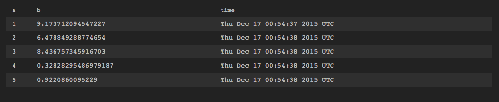
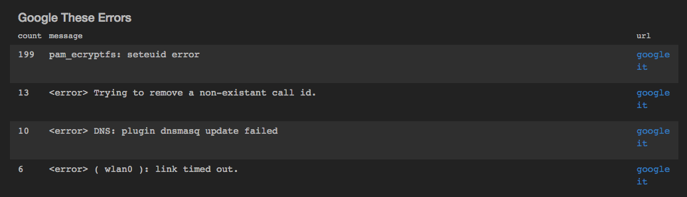

table
=====

Display the output as text in rows and columns.  
*This is the default output if no other is specified.*


``` 

view table -o {
   id: 'string',
   title: 'string',
   height: n,
   limit: n,
   update: 'replace|append',
   columnOrder: 'col1',...'colN',
   markdownFields: ['field1',...'fieldN']
}

```

*or*
```
view table -id 'string' -title 'string' -height n -limit n -update 'replace|append' -columnOrder 'col1',...'colN' -markdownFields ['field1',...'fieldN']
```

See [Defining sink parameters](../index.md#defining-view-parameters)
for an explanation of how sink parameters can be expressed as object literals.

Parameter  |  Description  |  Required?
---------- | ------------- | ---------:
`-id`  |  An identifier for this sink that serves as a handle for referencing the object in Juttle syntax; conceptually identical to a variable name  |  No
`-title`  |  The title for the user-visible output, if it has one; the value may be any valid Juttle expression that produces a string  |  No; defaults to the name field that is present in all metrics points
`-height`   The height in pixels of the table display before a scroll bar appears  |  No; default is 400 pixels
`-limit`  |  The maximum number of total data points to display  |  No; defaults to the first 1000 to avoid consuming unbounded memory
`-update`  | How to display new batches of data, one of the following:<dl><dt>replace:</dt><dd>Replace the current rows with new rows. </dd><dt>append:</dt><dd>Add new rows to the end of the table.</dd></dl>    |  No; default is 'append'
`-columnOrder`  |  An array of field names specifying the order of the table columns from left to right. If the data stream includes unspecified fields, these are displayed to the right of the specified ones, in alphabetical order.  |  No; default is 'time','name','value' followed by the remaining columns in alphabetical order
`-markdownFields`  |  An array of fields to interpret as markdown, for example to turn certain fields into hyperlinks, as in [the example below](#table-markdown) <p>:baby_symbol: `experimental:` We're still working on this feature. Try it and see what you think, then [chat with us](http://www.jut.io) to provide feedback.</p> |  No

_Example: Table with ordered columns_

```
{!docs/examples/charts/table_column_order.juttle!}
```



_Example: Table with markdown_ <a name="table-markdown"></a>

```
{!docs/examples/charts/table_markdown.juttle!}
```



