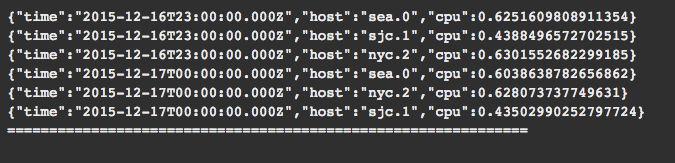
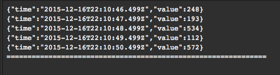
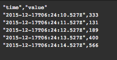

text
======

Display a raw dump of the output, in a fixed-width, console-style font, or as JSON or CSV.



```
view text -o {
   id: 'string',
   title: 'string',
   height: n,
   limit: n,
   format: 'raw|json|csv'
}
```

*or*
```
view text -id 'string' -title 'string'
  -height n
  -limit n
  -format 'raw'
```

See [Defining sink parameters](../index.md#defining-view-parameters) for an explanation of how sink parameters can be expressed as object literals.

Parameter  |  Description  |  Required?
---------- | ------------- | ---------:
`-id`  |  An identifier for this sink that serves as a handle for referencing the object in Juttle syntax; conceptually identical to a variable name  |  No
`-title`  |  The title for the user-visible output, if it has one; the value may be any valid Juttle expression that produces a string  |  No; defaults to the name field that is present in all metrics points
`-height`   The height of the log display in number of lines  |  No; default is 20 lines
`-limit`  |  The total number of log lines to display  |  No; default is all log lines produced by the flowgraph
`-format`  |  You can set this to 'csv' or 'json' to get CSV or pretty-printed JSON output, respectively. Batch delimiters are ignored when 'json' or 'csv' is specified. |  No; default is 'raw', which produces one data point per line, plus batch delimiters

_Example: raw display style_

```
{!docs/examples/charts/text_raw.juttle!}
```



_Example: CSV format_

```
{!docs/examples/charts/text_csv.juttle!}
```



_Example: JSON format_

```
{!docs/examples/charts/text_json.juttle!}
```


