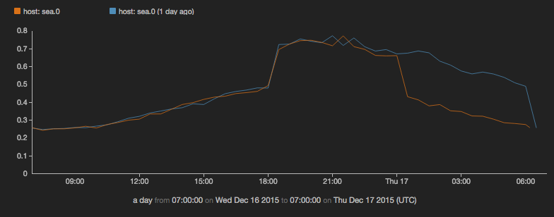
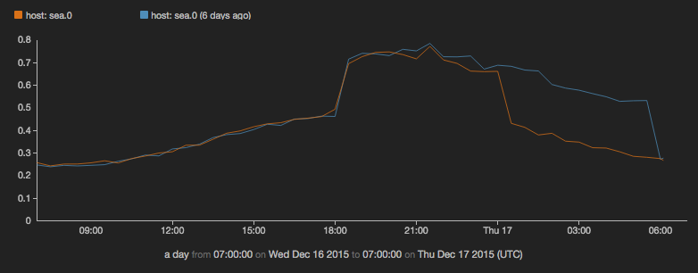
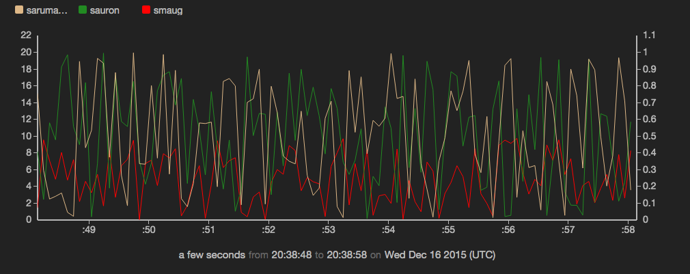
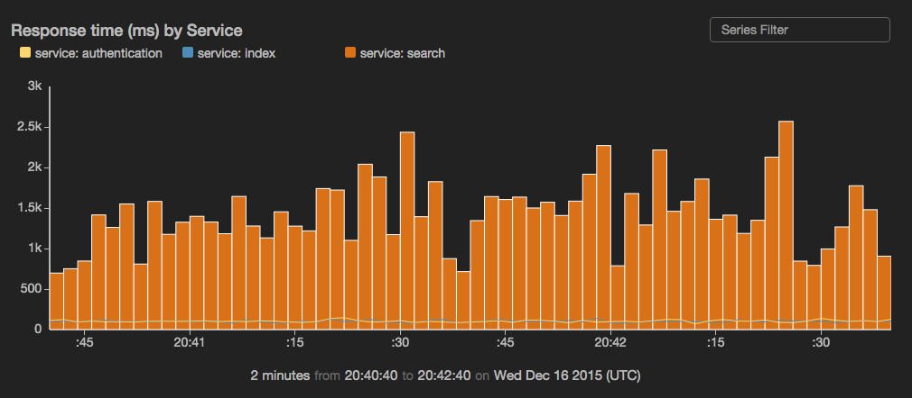

timechart
=========

Create a time series chart. Time charts support multiple series and can be combined with
[`view events`](../charts/events.md).


   - [Comparing data from different intervals](../charts/timechart_overlay.md)
   - [Overlaying events on time charts](../charts/timechart_overlay.md)
   - [Interacting with time charts](../charts/timechart_interactive.md)
   - [Zooming on historical data](../charts/timechart_zoom.md)
   - [Multi-series time charts](../charts/timechart_multi_series.md)
   - [Creating a dual-axis time chart](../charts/timechart_dual_axis.md)

```
view timechart -o {
  id: 'string',
  title: 'string',
  duration: duration,
  markerSize: n,
  overlayTime: boolean,
  downsample: boolean,
  xScale: {
   label: 'string',
   tickFormat: 'd3FormatString'
  },
  yScales: {
   primary: {
    label: 'string',
    tickFormat: 'd3FormatString',
    minValue: n,
    maxValue: n,
    displayOnAxis: 'left'
   },
   secondary: {
    label: 'string',
    tickFormat: 'd3FormatString',
    minValue: n,
    maxValue: n,
    displayOnAxis: 'right'
   }
  },
  keyField: 'fieldname',
  valueField: 'fieldname',
  timeField: 'fieldname',
  interval: 'n',
  series: [
   {
    name: 'seriesname',
    label: 'string',
    yScale: 'primary|secondary',
    color: 'color',
    geom: 'line|bars'
   }
  ]
}   
```

*or*
```
view timechart -id 'string' -title 'string' -duration duration -downsample boolean -markerSize n -overlayTime boolean
   -xScale.label 'string' -xScale.tickFormat 'd3FormatString'
  -yScales.primary.label 'string' -yScales.primary.tickFormat 'd3FormatString' -yScales.primary.minValue 'n' -yScales.primary.maxValue 'n' -yScales.primary.displayOnAxis 'left'
   -yScales.secondary.label 'string' -yScales.secondary.tickFormat 'd3FormatString' -yScales.secondary.minValue 'n' -yScales.secondary.maxValue 'n' -yScales.secondary.displayOnAxis 'left'
   -keyField 'fieldname' -valueField 'fieldname' -timeField 'fieldname'
   -interval n -series [{name : 'seriesname', label : 'string', yScale : 'primary|secondary', color : 'color', geom : 'line|bars'}]
```

See [Defining sink parameters](../index.md#defining-view-parameters)
for an explanation of how sink parameters can be expressed as object literals.


Parameter  |  Description  |  Required?
---------- | ------------- | ---------:
`-id`  |  An identifier for this sink that serves as a handle for referencing the object in Juttle syntax; conceptually identical to a variable name  |  No
`-title`  |  The title for the user-visible output, if it has one; the value may be any valid Juttle expression that produces a string  |  No; defaults to the name field that is present in all metrics points
`-duration`  |  <p>The span of time to display, either in seconds (&gt;=10) or as a Juttle moment literal. <br><br>This feature can also be used for comparing data from multiple intervals, such as this week's Web traffic versus last week's. This is done by setting the -overlayTime flag to true.  |  No
`-downsample`  | Whether the timechart should downsample data by averaging. Downsampling is triggered when the point density exceeds 1 point per 2 pixels.   |  No; defaults to true
`-markerSize`  |  <p>he diameter of the circle representing each point, in pixels </p><p>When your data is not very dense, the chart renders distinctly separate circles connecting by a one-pixel line. For denser data, circles may be rendered close together, giving the appearance of a continuous line of the specified thickness.  </p>  |  No; defaults to 0 (circle not shown)
`-overlayTime`  |  Whether the -duration value should be used to overlay time ranges. When true, the value of -duration drives the time-length of each overlayed range.  |  No; defaults to false
`-xScale.label`  |  The string that labels the X scale  |  No; defaults to the value of the `time` field
`-xScale.tickFormat`  |  Customize the unit display for this axis, using the [d3 number formatting syntax](https://github.com/mbostock/d3/wiki/Formatting)  |  No
`-yScales.primary.label`  |  A string to label the Y axis  | No; default is the name of the `-valueField`
`-yScales.primary.tickFormat`  |  Customize the unit display for the Y axis, using the [d3 number formatting syntax](https://github.com/mbostock/d3/wiki/Formatting)  |  No
`-yScales.primary.minValue`  |  The value at the bottom of the Y scale  |  No; the default is automatically derived from your data  
`-yScales.primary.maxValue`  |  The value at the top of the Y scale  |  No; the default is automatically derived from your data  
`-yScales.primary.displayOnAxis`  |  Where to display the Y axis; must be exactly one of the following depending on whether your bar chart is oriented vertically or horizontally: <ul><li>left</li><li>right</li></ul>  |  No; the default is left  
`-yScales.secondary.label`  |  The string that labels the secondary Y scale  |  No; by default no label is displayed
`-yScales.secondary.tickFormat`  |  Customize the unit display for this axis, using the [d3 number formatting syntax](https://github.com/mbostock/d3/wiki/Formatting)  |  No  
`-yScales.secondary.minValue`  |  The value at the bottom of the Y scale  |  No; the default is automatically derived from your data  
`-yScales.secondary.maxValue`  |  The value at the top of the Y scale  |  No; the default is automatically derived from your data  
`-yScales.secondary.displayOnAxis`  |  The axis on which to display this scale, either 'left' or 'right'  |  No; defaults to 'left'  
`-keyField`  |  The field containing the name of the series to which each point belongs  |  <p>Required when series is configured; otherwise Jut looks for unique streams and creates a series for each one </p><p>For simple metrics, the key field usually defaults to the `name` field that is present in all metrics points</p>
`-valueField`  |  The name of the field to use as the source for the numeric values  |  No; defaults to the `value` field that is present in all metrics points. If no value field is present, the first numeric field in the stream is used.
`-timeField`  |  The field containing the time stamp  |  No; defaults to the time field
`-interval`  |  The duration threshold between two consecutive points, above which they will not be connected by a line  |  No; all points are connected by lines
`-series`  |  Configure one or more data series individually, using one or more items in an array with these parameters:  |  No

```   
   -series [   
   {   
    name : 'seriesname',   
    label : 'string',   
    yScale : 'primary|secondary',   
    color : 'color',   
    geom : 'line|bars'   
   },   
   {   
    name : 'someotherseries',   
   ...   
   }   
  ]   
```

#### Series Parameters

`-series` Parameter |  Description
------------------- | -------------
`name`  |  A series name that can be found in the specified `-keyField`; omit this option to configure all series in the data set
`label`  |  An optional string to override the scale label for this series   
`yScale`  |  The Y scale to use for this series, either "primary" or "secondary"; the default is "primary"   
`color`  |  The color to use for this series, specified with any [CSS3-supported hex or name value](http://www.w3.org/TR/css3-color/); if not specified, a color is selected from the built-in palette   
`geom`  |  Set this to `'bars'` to display this series as bars on the time chart; the width of each bar is the interval between the current point and the previous point. The default is `'line'`.   

_Example: Timechart with default series selection_

```
{!docs/examples/charts/timechart_default_series.juttle!}
```


_Example: Compare yesterday's CPU usage with usage today so far_ 

```
{!docs/examples/charts/timechart_time_overlay_1.juttle!}
```



_Example: Compare CPU usage from today with the same day last week_ 

```
{!docs/examples/charts/timechart_time_overlay_2.juttle!}
```



_Example: Configure a multi-series time chart_ 

```
{!docs/examples/charts/timechart_multi_series_1.juttle!}
```



_Example: Configure one series to be displayed as bars, while others are displayed as lines_

```
{!docs/examples/charts/timechart_with_bars.juttle!}
```


