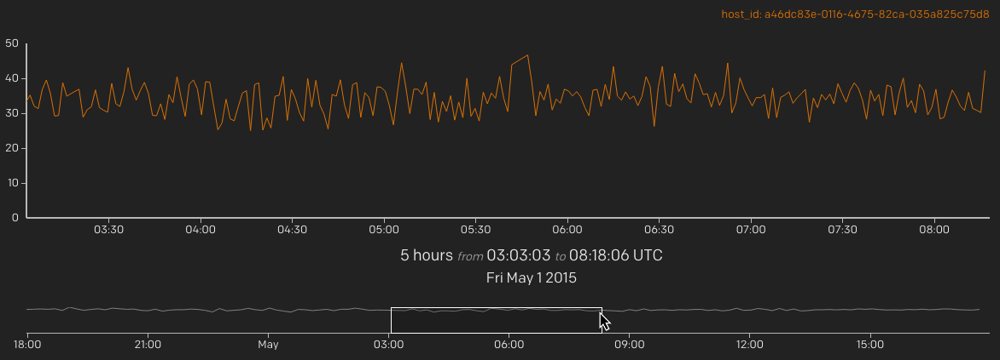

Zooming on historical data 
==========================

When a time chart contains historical data only, it also displays a
context chart at the bottom that allows you to zoom in on a smaller
portion of the chart for closer inspection.

Click and drag across the context chart to select a segment of the chart
to zoom in:

Once you've drawn a rectangle in the context chart, you can drag the
rectangle left or right. Click outside the selected rectangle to reset
the zoom.

